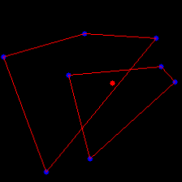

# 🌟 Stellar Transformers

> **Vision Transformers for Autonomous Star Tracking and Attitude Estimation**

[](https://python.org)
[](https://pytorch.org)
[](LICENSE)
[](https://doi.org/)
[](https://stellarium.org)

**Authors:** Menah Hammad · May Hammad · Steve Urlich
**Affiliation:** Space Dynamics Lab, Carleton University · Julius-Maximilians-Universität Würzburg

---

## Overview

Stellar Transformers is an end-to-end deep learning framework for autonomous spacecraft attitude estimation. Rather than relying on traditional star catalog matching pipelines, the system directly regresses **Right Ascension (RA)** and **Declination (DEC)** from raw starfield images — eliminating the multiple intermediate failure points of classical star trackers.

The core innovation is the fusion of two complementary feature streams:
- **Visual features** extracted by a pretrained Vision Transformer (ViT)
- **Geometric features** derived from the internal angles of convex polygons formed by the brightest detected stars

These are combined through element-wise addition and passed to a regression head that outputs continuous celestial coordinates.


---

## System Pipeline

<!-- ═══════════════════════════════════════════════════════════════════════════
     FIGURE PLACEHOLDER — Full system pipeline diagram
     Replace the block below with your figure once available.

     Suggested image: a horizontal flow diagram showing the six stages:
       Stellarium Input → Preprocessing → Star Detection →
       Polygon Construction → ViT + Angle Embedding → RA / DEC Output
     Recommended filename: docs/figures/system_pipeline.png
═══════════════════════════════════════════════════════════════════════════ -->

```
┌─────────────────────────────────────────────────────────────────────────┐
│                        [ SYSTEM PIPELINE FIGURE ]                       │
│                                                                         │
│  Place your full pipeline diagram here:                                 │
│  docs/figures/system_pipeline.png                                       │
│                                                                         │
│  Recommended: horizontal flow with six labeled stages and arrows        │
└─────────────────────────────────────────────────────────────────────────┘
```

<!-- Uncomment and update path when figure is ready:

-->


## Method

### Core Idea

Traditional star trackers perform: **detect → identify → match catalog → compute attitude**.
Every step is a failure point. Our approach collapses this into a single learned mapping:

```
starfield image  +  polygon angles  →  [RA, DEC]
```

### Two Feature Streams

**Visual stream:** A pretrained ViT divides the 224×224 input into patches, processes them through multi-head self-attention layers, and outputs a d-dimensional visual embedding that captures both local star relationships and global constellation-level patterns.

**Geometric stream:** The 8 brightest clustered stars are connected into one or two convex polygons. The internal angle at each vertex k is:

```
cos(θ_k) = (p_{k-1} - p_k) · (p_{k+1} - p_k)
            ─────────────────────────────────────
            ‖p_{k-1} - p_k‖ · ‖p_{k+1} - p_k‖
```

These angles are **rotation-invariant** and **scale-invariant** — the same star configuration produces the same angle vector regardless of the spacecraft's roll orientation.

**Fusion:** The two d-dimensional embeddings are combined via element-wise addition (not concatenation), keeping the representation compact and jointly optimisable.

---

## Dataset & Preprocessing

### Data Generation

Synthetic starfield images were generated using [Stellarium](https://stellarium.org), configured as a spacecraft sensor simulator rather than an Earth-based observer. RA and DEC were varied systematically across the full celestial sphere:

| Parameter | Value |
|-----------|-------|
| RA coverage | 0° – 360° |
| DEC coverage | −90° – +90° |
| Train / Test split | 80% / 20% |
| Crop resolution | 224 × 224 px |

> **Note:** The dataset is not tied to any geographic location on Earth. Stellarium is used in a celestial-coordinate mode where the camera orientation (RA, DEC) is varied directly, independent of terrestrial position.

### Preprocessing Pipeline

<!-- ═══════════════════════════════════════════════════════════════════════════
     FIGURE PLACEHOLDER — Preprocessing pipeline comparison
     Replace the block below with your figure once available.

     Suggested image: side-by-side showing original uncropped starfield
     on the left and the 224×224 centroid-cropped result on the right,
     with detected bright stars overlaid as red dots.
     Recommended filename: docs/figures/preprocessing_comparison.png
═══════════════════════════════════════════════════════════════════════════ -->

┌─────────────────────────────────────────────────────────────────────────┐
│                  [ PREPROCESSING COMPARISON FIGURE ]                    │
│                                                                         │
│  Place your before/after cropping comparison here:                      │
│  docs/figures/preprocessing_comparison.png                              │
│                                                                         │
│  Left:  original uncropped starfield with detected bright stars         │
│  Right: 224×224 centroid-cropped region with stars overlaid             │
└─────────────────────────────────────────────────────────────────────────┘


<!-- Uncomment and update path when figure is ready:

-->

Each captured image passes through six stages:

**Stage 1 — Adaptive Thresholding**
Applied to isolate bright stellar pixels and suppress background noise. Only pixels above an adaptive intensity threshold are retained.

**Stage 2 — Centroid Extraction**
The dominant centre of the starfield is computed as the intensity-weighted mean of all retained pixels:

```
x_c = Σ(I_i · x_i) / Σ(I_i)
y_c = Σ(I_i · y_i) / Σ(I_i)
```

**Stage 3 — Region-of-Interest Cropping**
A 224×224 pixel window is extracted centered on (x_c, y_c), standardising the input dimensions and removing peripheral noise. See figure above for a before/after comparison.

**Stage 4 — Bright Star Detection**
The 20 brightest stars in the cropped image are extracted. Nearby detections caused by noise or overlapping point spread functions are merged through spatial clustering.

**Stage 5 — Polygon Construction**
Up to 8 of the brightest clustered stars are retained and connected into convex polygons:

| Stars available | Polygon configuration |
|----------------|----------------------|
| 8 | Two quadrilaterals |
| 6 | One triangle + one quadrilateral |
| 4 | Single quadrilateral |

**Stage 6 — Angle Encoding**
The internal angles of each polygon are computed and assembled into a rotation- and scale-invariant feature vector θ = [θ₁, θ₂, ..., θₙ]ᵀ.

### Polygon Visualisation


┌─────────────────────────────────────────────────────────────────────────┐
│                    [ POLYGON OVERLAY FIGURE ]                           │
│                                                                         │
│  Place your polygon visualisation here:                                 │
│  docs/figures/polygon_overlay.png                                       │
│                                                                         │
│  Blue polygons connecting the brightest stars                           │
│  Internal angles labelled · Red dot = computed centroid                 │
└─────────────────────────────────────────────────────────────────────────┘


<!-- Uncomment and update path when figure is ready:

-->

---

## Model Architecture

```
Starfield Image (224×224)
        │
        ▼
┌───────────────────┐      8 Polygon Angles
│   ViT Backbone    │      │
│  Patch embeddings │      ▼
│  + Self-attention │  ┌──────────────────┐
└───────────────────┘  │ Linear Projection │
        │              │  8 angles → d-dim │
        ▼              └──────────────────┘
  Visual Embedding            │
   (d-dim vector)             ▼
        │           Angle Embedding
        │            (d-dim vector)
        └──────────┬──────────┘
                   │
                   ▼
          Element-wise Addition
                   │
                   ▼
         ┌──────────────────┐
         │  Regression Head  │
         │  FC → ReLU → Drop │
         └──────────────────┘
                   │
          ┌────────┴────────┐
          ▼                 ▼
     Right Ascension    Declination
         (RA °)            (DEC °)
```

The ViT backbone is pretrained and fine-tuned end-to-end together with the angle embedding and regression head.

---

## Training

| Hyperparameter | Value |
|----------------|-------|
| Loss function | Mean Squared Error (MSE) |
| Optimizer | Adam (β₁=0.9, β₂=0.999) |
| Initial learning rate | 1 × 10⁻⁴ |
| Weight decay | 1 × 10⁻⁴ |
| Epochs | 80 |
| LR schedule | Cosine decay + 5% linear warmup |
| Hardware | NVIDIA GPU, mixed-precision (fp16) |

### Learning Rate Schedule

Linear warmup for the first 5% of steps (t_w = 1000), then cosine decay:

```
Warmup:  η(t) = η₀ · t / t_w           for 0 ≤ t ≤ t_w
Cosine:  η(t) = (η₀/2)(1 + cos(π(t − t_w)/(T − t_w)))   for t > t_w
```

### Data Augmentation

| Technique | Purpose |
|-----------|---------|
| Random rotations around centroid | Simulate spacecraft roll changes |
| Additive Gaussian noise | Sensor noise and background interference |
| Random pixel shifts | Minor alignment errors |
| Artificial double-star insertion | Robustness to closely spaced stars |
| Random planar rotations ±2° | Generalise geometric features |

---

## Installation

```bash
# Clone the repository
git clone https://github.com/your-org/stellar-transformers.git
cd stellar-transformers

# Create a virtual environment
python -m venv venv
source venv/bin/activate        # Linux / macOS
venv\Scripts\activate           # Windows

# Install dependencies
pip install -r requirements.txt
```

### Requirements

```
torch>=2.0.0
torchvision>=0.15.0
timm>=0.9.0
numpy>=1.24.0
opencv-python>=4.7.0
scipy>=1.10.0
matplotlib>=3.7.0
scikit-learn>=1.2.0
tqdm>=4.65.0
Pillow>=9.5.0
```

---


## Citation

If you use this work, please cite:

```bibtex
@inproceedings{hammad2025stellar,
  title     = {Stellar Transformers: Vision Transformers for Autonomous Star Tracking and Attitude Estimation},
  author    = {Hammad, Menah and Hammad, May and Urlich, Steve},
  booktitle = {Proceedings of the IEEE Conference on Space Navigation},
  year      = {2025},
  institution = {Space Dynamics Lab, Carleton University}
}
```

For the earlier SSIT baseline:

```bibtex
@inproceedings{hammad2024ssit,
  title  = {SSIT: Self-Supervised Star Identification Transformer},
  author = {Hammad, Menah and others},
  year   = {2024}
}
```

---

## License

This project is licensed under the MIT License. See [LICENSE](LICENSE) for details.

---

<p align="center">
  Space Dynamics Lab · Carleton University · Julius-Maximilians-Universität Würzburg
</p>
